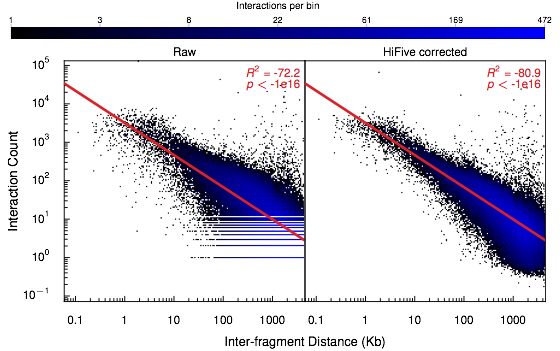
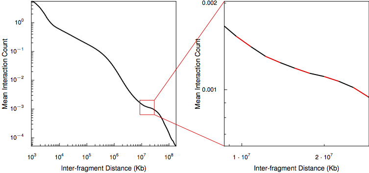

.. _distance_dependence:

*******************************
Distance-Dependence Estimation
*******************************

Restriction sites throughout the genome are unevenly distributed. This results in greatly varying sets of distances between fragments and their neighbors. Because interaction signal is strongly inversely-related to inter-fragment distance, this unequal distribution means that fragments with lots of shorter adjacent fragments have a nearby neighborhood of higher interaction values than fragments surrounded by longer restriction fragments simply due to cutsite variation. In order to avoid biases that may result due to restriction site distribution characteristics or the influence of the distance/signal relationship, as well as for estimating enrichment signal, HiFive estimates the distance-dependence relationship from the data prior to normalization using the functions :func:`find_distance_parameters <hifive.fivec.FiveC.find_distance_parameters>` and :func:`find_distance_parameters <hifive.hic.HiC.find_distance_parameters>` for 5C and HiC, respectively.

5C Distance-Dependence Estimation
==================================

5C data are typically limited to shorter interaction distance ranges (< 10Mb). In addition, the limited number of interactions targeted in a 5C experiment make it feasible to directly estimate the distance-dependence relationship from the data without binning. The ranges that these data span show a fairly good adherence to an inverse power-law relationship, such that the log-interaction signal is inversely linearly related to the log of the inter-fragment distance. Because log-counts are being used, the distance-dependence relationship is found only for non-zero counts.

HiC Distance-Dependence Estimation
==================================

HiC data cover a wide range of interaction distances and while portions of the distance curve appear to follow the power-law for some but not all regions. Coupled with the low coverage, especially in long-range cis interactions, HiFive approximates the HiC distance-dependence relationship using a piece-wise linear reconstruction of the relationship between the log-counts and log-distances.

The log-distance range covered by interactions is divided into equal-sized bins and the mean signal and mean log-distance are calculated for each bin. Finally, a series of line segments connecting adjacent log-mean signal and mean log-distance points are calculated. When estimating the expected distance-dependent signal for a given log-distance, HiFive uses the line segment spanning the query log-distance value. If the value falls before the first mean log-distance or after the last mean log-distance, the nearest line segment equation is used to infer the expected signal.

The same strategy is used to simultaneously estimate a distance-dependence relationship between log-distance and a binary indicator of observed/unobserved instead of counts.

If data are binned (associated with a fend file created with the 'binned' flag), the smallest bin size should be just smaller than the binsize (e.g. for data pre-binned at 40Kb resolution, a minimum distance bin size of 39Kb is appropriate). This is because the diagonal is included in analysis which is shifted to an interaction distance of 1 to avoid issues when the distance is log-transformed.