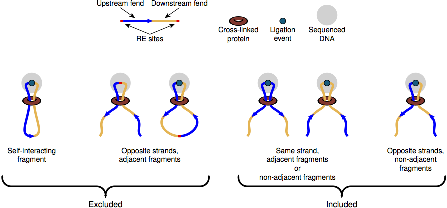

.. _filtering_data:

************************
Filtering Data
************************

.. _fivec_filtering:

5C Filtering
============

HiFive filters reads from 5C experiments in two stages.

1. When a data object is created and data are loaded, only valid reads are read in. In 5C, this means only reads that represent an interaction between a forward-probed restriction fragment and a reverse-probed restriction fragment.

2. HiFive calls a function (:func:`filter_fragments <hifive.fivec.FiveC.filter_fragments>`) after a project is created and loaded with data that iteratively removes reads to produce a set of fragments that meet a minimum threshold of interactions with other valid fragments within the same region. This filtering is done using the number of interacting fragments rather than reads to account for the fact that fragment biases can produce wildly different numbers of interactions between fragment pairs. This filtering can also be limited to interactions falling within some range limitation of interaction distance. This can be used to ensure that fragments have sufficient reads for learning correction parameters when distance range constraints are used for normalization.

.. _hic_filtering:

HiC Filtering
=============

HiFive filters reads from HiC experiments in two stages.

1. When a data object is created and data are loaded, only valid reads are read in. In HiC, this means that reads with identical mapping coordinates at both ends are assumed to be PCR duplicates and only one read is counted. Reads are also filtered by the insert size as determined by the sum of the distances from the mapped positions of both ends to the nearest downstream target restriction site for each. In addition, because of the possibility of incomplete restriction enzyme digestion and fragment circularization, reads with ends mapping to the same fragment and reads with ends mapping to adjacent fragments on opposite strands are also excluded from the data object.

2. HiFive calls a function (:func:`filter_fragments <hifive.hic.HiC.filter_fends>`) after a project is created and loaded with data that iteratively removes reads to produce a set of fends that meet a minimum threshold of interactions with other valid fends on the same chromosome. This filtering is done using the number of interacting fends rather than reads to account for the fact that fend biases can produce wildly different numbers of interactions between fend pairs. This filtering can also be limited to interactions falling within some range limitation of interaction distance. This can be used to ensure that fends have sufficient reads for learning correction parameters when distance range constraints are used for normalization.
