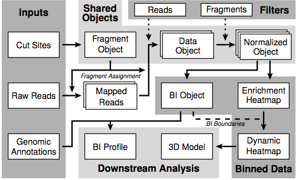

.. _introduction:

************
Introduction
************

:mod:`HiFive` is a Python package for normalization and analysis of chromatin structural data produced using either the 5C of HiC assay. This library contains tools for handling all steps after mapping of reads.

.. _organization_of_the_hifive_package:

Organization of the :mod:`HiFive` package
=========================================

The :mod:`HiFive` package is split into several modules, each serving a specific purpose.

================================  ====================================
Functionality                     Module               
================================  ====================================
Restriction enzyme information    :class:`Fragment <hifive.fragment.Fragment>` / :class:`Fend <hifive.fend.Fend>`
Read counts and orientations      :class:`FiveCData <hifive.fivec_data.FiveCData>` / :class:`HiCData <hifive.hic_data.HiCData>`
Model parameters and filtering    :class:`FiveC <hifive.fivec.FiveC>` / :class:`HiC <hifive.hic.HiC>`
Boundary index                    :class:`BI <hifive.bi.BI>`
Plotting functions                :mod:`plotting <hifive.plotting>`
================================  ====================================

The classes :class:`Fragment <hifive.fragment.Fragment>`, :class:`Fend <hifive.fend.Fend>`, :class:`FiveCData <hifive.fivec_data.FiveCData>`, :class:`HiCData <hifive.hic_data.HiCData>`, :class:`FiveC <hifive.fivec.FiveC>`, :class:`HiC <hifive.hic.HiC>`, and :class:`BI <hifive.bi.BI>` are all available from the top level of the :mod:`HiFive` namespace and can be imported using::

  from hifive import *

at the beginning of the Python program. However, in order to prevent namespace pollution, you may also simply use import hifive.

HiFive is organized into a hierarchy of data structures. Each structure represents a set of data that may be shared with any number of structures higher in the hierarchy, thus eliminating redundency of information. For example, a :class:`Fragment <hifive.fragment.Fragment>` object which contains information about the fragments being interogated in a 5C experiment can be used for all replicates and conditions that use the same primer scheme. Likewise, a :class:`HiCData <hifive.hic_data.HiCData>` object which contains all of the mapped read information for a specific HiC experiment can be used for multiple analyses with different parameter values. This helps reduce the space these data occupy as well as reduce the time to run mutiple analyses since each object need only be created once.

The organization of structures is as follows:

